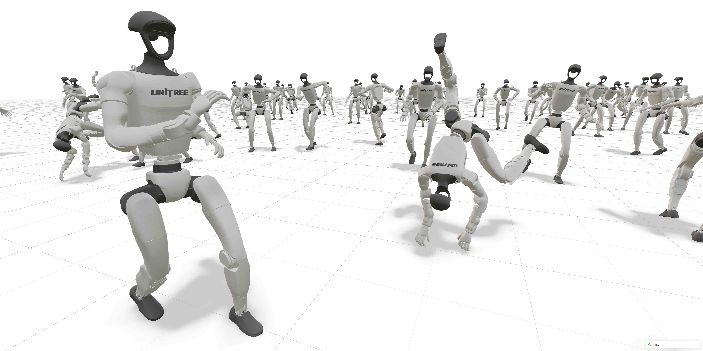

# mjlab

<p align="left">
  
</p>

mjlab combines [Isaac Lab](https://github.com/isaac-sim/IsaacLab)'s proven API with best-in-class [MuJoCo](https://github.com/google-deepmind/mujoco_warp) physics to provide lightweight, modular abstractions for RL robotics research and sim-to-real deployment.

> ⚠️ **BETA PREVIEW**
> mjlab is in active development. Expect **breaking changes** and **missing features** during the beta phase.
> There is **no stable release yet**. The PyPI package is only a snapshot — for the latest fixes and improvements, install from source or Git.

---

## Quick Start

mjlab requires an **NVIDIA GPU** for training (via MuJoCo Warp).
macOS is supported only for evaluation, which is significantly slower.

```bash
# Install uv if you haven't already
curl -LsSf https://astral.sh/uv/install.sh | sh
```

Run the demo (no installation needed):

```bash
uvx --from mjlab --with "mujoco-warp @ git+https://github.com/google-deepmind/mujoco_warp@486642c3fa262a989b482e0e506716d5793d61a9" demo
```

This launches an interactive viewer with a pre-trained Unitree G1 agent tracking a reference dance motion in MuJoCo Warp.

> ❓ Having issues? See the [FAQ](docs/faq.md).

---

## Installation

**From source (recommended during beta):**

```bash
git clone https://github.com/mujocolab/mjlab.git
cd mjlab
uv run demo
```

**From PyPI (beta snapshot):**

```bash
uv add mjlab "mujoco-warp @ git+https://github.com/google-deepmind/mujoco_warp@486642c3fa262a989b482e0e506716d5793d61a9"
```

For full setup instructions, see the [Installation Guide](docs/installation_guide.md).

---

## Training Examples

### 1. Velocity Tracking

Train a Unitree G1 humanoid to follow velocity commands on flat terrain:

```bash
MUJOCO_GL=egl uv run train Mjlab-Velocity-Flat-Unitree-G1 --env.scene.num-envs 4096
```

Evaluate a policy while training (fetches latest checkpoint from Weights & Biases):

```bash
uv run play Mjlab-Velocity-Flat-Unitree-G1-Play --wandb-run-path your-org/mjlab/run-id
```

---

### 2. Motion Imitation

Train a Unitree G1 to mimic reference motions. mjlab uses [WandB](https://wandb.ai) to manage reference motion datasets:

1. **Create a registry collection** in your WandB workspace named `Motions`

2. **Set your WandB entity**:
   ```bash
   export WANDB_ENTITY=your-organization-name
   ```

3. **Process and upload motion files**:
   ```bash
   MUJOCO_GL=egl uv run src/mjlab/scripts/csv_to_npz.py \
     --input-file /path/to/motion.csv \
     --output-name motion_name \
     --input-fps 30 \
     --output-fps 50 \
     --render  # Optional: generates preview video
   ```

> **Note**: For detailed motion preprocessing instructions, see the [BeyondMimic documentation](https://github.com/HybridRobotics/whole_body_tracking/blob/main/README.md#motion-preprocessing--registry-setup).

#### Train and Play

```bash
MUJOCO_GL=egl uv run train Mjlab-Tracking-Flat-Unitree-G1 --registry-name your-org/motions/motion-name --env.scene.num-envs 4096

uv run play Mjlab-Tracking-Flat-Unitree-G1-Play --wandb-run-path your-org/mjlab/run-id
```

---

### 3. Sanity-check with Dummy Agents

Use built-in agents to sanity check your MDP **before** training.

```bash
uv run play Mjlab-Your-Task-Id --agent zero  # Sends zero actions.
uv run play Mjlab-Your-Task-Id --agent random  # Sends uniform random actions.
```

> [!NOTE]
> When running motion-tracking tasks, add `--registry-name your-org/motions/motion-name` to the command.

---

### 4. Train the Ludan V0 Custom Robot (Velocity Tracking)

The repository ships with the `ludan_v0` URDF and a helper script that produces an MJCF
compatible with the `Mjlab-Velocity-Flat-Custom` task. Start with the smoke test below to
validate the pipeline before launching a large job.

1. **Convert the URDF into MJCF** (re-run whenever you edit the URDF or meshes):

   ```bash
   uv run convert-urdf-to-mjcf
   # Optional arguments:
   #   --package-map ludan_v0=/path/to/package  # Override mesh search paths
   #   --keep-resolved-urdf                     # Inspect the intermediate URDF
   ```

   The command generates `ludan_v0/mjcf/ludan_v0.xml` and removes temporary files by default.

2. **Point the custom task at the converted MJCF**:

   ```bash
   export MJLAB_CUSTOM_ROBOT_XML=$(pwd)/ludan_v0/mjcf/ludan_v0.xml
   ```

   Useful overrides for the Ludan V0 robot:

   - `--env.robot.contact-bodies RightAnkleRoll LeftAnkleRoll` — enables air-time rewards.
   - `--env.robot.foot-geom-names RightAnkleRoll_collision LeftAnkleRoll_collision` — enables per-foot friction randomization.
   - `--env.robot.viewer-body-name Body` — centers the viewer on the torso when playing back a policy.

3. **Run a smoke-test training session** (CPU friendly, ~32 envs):

   ```bash
   MUJOCO_GL=egl uv run train Mjlab-Velocity-Flat-Custom \
     --env.scene.num-envs 32 \
     --agent.max-iterations 50 \
     --agent.run-name ludan-smoke \
     --env.robot.contact-bodies RightAnkleRoll LeftAnkleRoll \
     --env.robot.foot-geom-names RightAnkleRoll_collision LeftAnkleRoll_collision
   ```

4. **Inspect the policy in the interactive viewer** (point at the saved checkpoint):

   ```bash
   uv run play Mjlab-Velocity-Flat-Custom-Play \
     --env.scene.num-envs 1 \
     --checkpoint-file logs/rsl_rl/custom_robot_velocity/<run-folder>/model_00050.pt \
     --env.robot.contact-bodies RightAnkleRoll LeftAnkleRoll \
     --env.robot.foot-geom-names RightAnkleRoll_collision LeftAnkleRoll_collision
   ```

   Replace `<run-folder>` with the directory produced by the smoke-test job (for example,
   `2024-06-01_12-34-56_ludan-smoke`).

5. **Scale up once satisfied** (requires an NVIDIA GPU):

   ```bash
   MUJOCO_GL=egl uv run train Mjlab-Velocity-Flat-Custom \
     --env.scene.num-envs 4096 \
     --agent.max-iterations 30000 \
     --agent.run-name ludan-production \
     --env.robot.contact-bodies RightAnkleRoll LeftAnkleRoll \
     --env.robot.foot-geom-names RightAnkleRoll_collision LeftAnkleRoll_collision
   ```

> [!TIP]
> All `--env.robot.*` arguments accept tyro syntax, so you can tweak actuator gains, contact
> sensor parameters, and initial poses without editing source code.

---

## Documentation

- **[Installation Guide](docs/installation_guide.md)**
- **[Why mjlab?](docs/motivation.md)**
- **[Migration Guide](docs/migration_guide.md)**
- **[FAQ & Troubleshooting](docs/faq.md)**

---

## Development

Run tests:

```bash
make test
```

Format code:

```bash
uvx pre-commit install
make format
```

---

## License

mjlab is licensed under the [Apache License, Version 2.0](LICENSE).

### Third-Party Code

The `third_party/` directory contains files from external projects, each with its own license:

- **isaaclab/** — [NVIDIA Isaac Lab](https://github.com/isaac-sim/IsaacLab) ([BSD-3-Clause](src/mjlab/third_party/isaaclab/LICENSE))

When distributing or modifying mjlab, comply with:
1. The Apache-2.0 license for mjlab’s original code
2. The respective licenses in `third_party/`

---

## Acknowledgments

mjlab wouldn't exist without the excellent work of the Isaac Lab team, whose API design and abstractions mjlab builds upon.

Thanks to the MuJoCo Warp team — especially Erik Frey and Taylor Howell — for answering our questions, giving helpful feedback, and implementing features based on our requests countless times.
