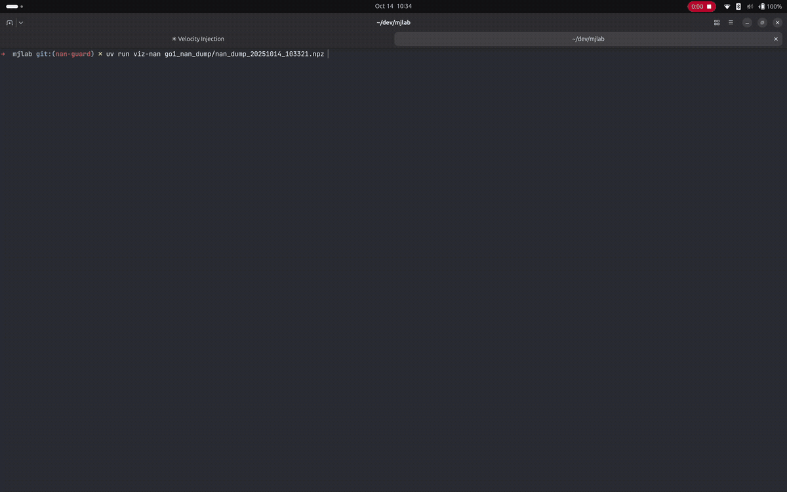

# NaN Guard

The NaN guard captures simulation states when NaN/Inf is detected, helping debug
numerical instability issues.

## TL;DR

**Running into NaN issues during training?** Enable the NaN guard with a single flag:

```bash
uv run train.py --enable-nan-guard True
```

This will automatically capture and save simulation states when NaN/Inf is
detected, making it easy to debug what went wrong.

You can also enable it programmatically in your simulation config:

```python
from mjlab.sim.sim import SimulationCfg
from mjlab.utils.nan_guard import NanGuardCfg

cfg = SimulationCfg(
  nan_guard=NanGuardCfg(
    enabled=True,
    buffer_size=100,
    output_dir="/tmp/mjlab/nan_dumps",
    max_envs_to_capture=5,
  ),
)
```

## Configuration

**`enabled`** (default: `False`)
Enable/disable NaN detection and dumping. When disabled, has minimal overhead.

**`buffer_size`** (default: `100`)
Number of recent simulation states to keep in rolling buffer.

**`output_dir`** (default: `"/tmp/mjlab/nan_dumps"`)
Directory where NaN dump files are saved.

**`max_envs_to_capture`** (default: `5`)
Maximum number of environments to capture (saves memory in large-scale sims).

## Behavior

- **Captures** simulation state before each step (using `mj_getState`)
- **Detects** NaN/Inf in `qpos`, `qvel`, `qacc`, `qacc_warmstart` after each step
- **Dumps** buffer and model to disk on first detection
- **Exits** only dumps once per training run to avoid spam

## Output Format

Each NaN detection creates two files:
- `nan_dump_TIMESTAMP.npz` - Compressed state buffer
  - `states_step_NNNNNN` - Captured states for each step (shape:
    `[num_envs_captured, state_size]`)
  - `_metadata` - Dict with `num_envs_total`, `nan_env_ids`, `model_file`, etc.
- `model_TIMESTAMP.mjb` - MuJoCo model in binary format

## Visualizing Dumps

Use the interactive viewer to scrub through captured states:

```bash
uv run viz-nan /tmp/mjlab/nan_dumps/nan_dump_20251014_123456.npz
```

<p align="left">
  
</p>

The viewer provides:
- Step slider to scrub through the buffer
- Environment slider to compare different environments
- Info panel showing which environments have NaN/Inf
- 3D visualization of the robot and terrain at each state

This makes it easy to see exactly what went wrong and compare crashed
environments against clean ones.

## Performance

When disabled (`enabled=False`), all operations are no-ops with
negligible overhead. When enabled, overhead scales with `buffer_size` and
`max_envs_to_capture`.
