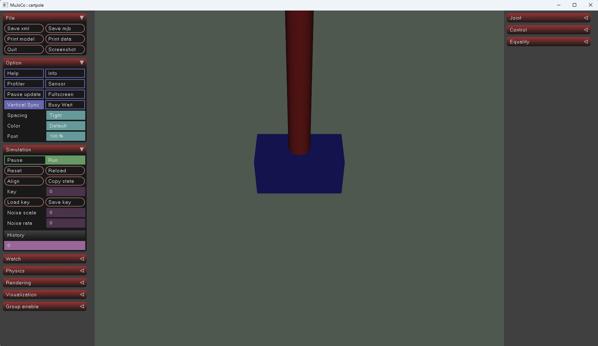
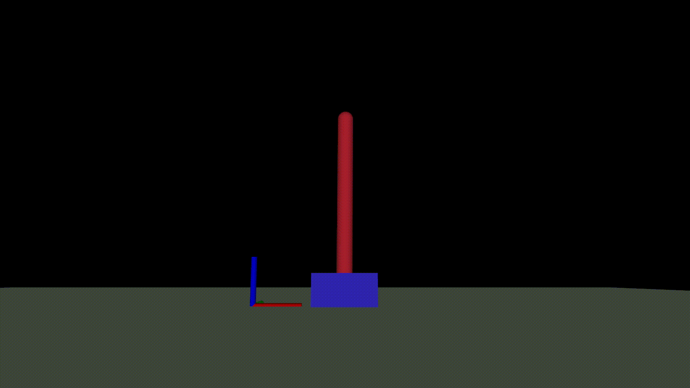

# Creating a New Task

This guide demonstrates how to create a custom task using a CartPole example.
You'll define the robot entity, configure the MDP, and train a policy.

> [!NOTE]
> Parameters may need tuning for optimal convergence.

## 1. Define the Robot

Define the robot model and entity configuration. This example uses a simple
CartPole with a sliding base and a hinged pole.

Create the following structure in `mjlab/src/mjlab/asset_zoo/robots`:

```
cartpole/
  cartpole_constants.py
  __init__.py
  xmls/
    cartpole.xml
```

### cartpole.xml

```xml
<mujoco model="cartpole">
  <compiler angle="degree" coordinate="local" inertiafromgeom="true"/>
  <worldbody>
    <geom name="ground" type="plane" pos="0 0 0" size="5 5 0.1" rgba="0.8 0.9 0.8 1"/>
    <body name="cart" pos="0 0 0.1">
      <geom type="box" size="0.2 0.1 0.1" rgba="0.2 0.2 0.8 1" mass="1.0"/>
      <joint name="slide" type="slide" axis="1 0 0" limited="true" range="-2 2"/>
      <body name="pole" pos="0 0 0.1">
        <geom type="capsule" size="0.05 0.5" fromto="0 0 0 0 0 1" rgba="0.8 0.2 0.2 1" mass="2.0"/>
        <joint name="hinge" type="hinge" axis="0 1 0" range="-90 90"/>
      </body>
    </body>
  </worldbody>
  <actuator>
    <velocity name="slide_velocity" joint="slide" ctrlrange="-20 20" kv="20"/>
  </actuator>
  <keyframe>
    <key name="cartpole_init" qpos="0 0" qvel="0 0" ctrl="0 0"/>
  </keyframe>
</mujoco>
```

### cartpole_constants.py

```python
from pathlib import Path
import mujoco

from mjlab import MJLAB_SRC_PATH
from mjlab.entity import Entity, EntityCfg, EntityArticulationInfoCfg
from mjlab.utils.spec_config import ActuatorCfg

CARTPOLE_XML: Path = (
  MJLAB_SRC_PATH / "asset_zoo" / "robots" / "cartpole" / "xmls" / "cartpole.xml"
)
assert CARTPOLE_XML.exists(), f"XML not found: {CARTPOLE_XML}"

def get_spec() -> mujoco.MjSpec:
  return mujoco.MjSpec.from_file(str(CARTPOLE_XML))

CARTPOLE_ACTUATOR = ActuatorCfg(
  joint_names_expr=["slide"],
  effort_limit=20.0,
  stiffness=0.0,
  damping=0.1,
)

CARTPOLE_ARTICULATION = EntityArticulationInfoCfg(
  actuators=(CARTPOLE_ACTUATOR,),
)

CARTPOLE_ROBOT_CFG = EntityCfg(
  spec_fn=get_spec,
  articulation=CARTPOLE_ARTICULATION,
)

if __name__ == "__main__":
  import mujoco.viewer as viewer
  robot = Entity(CARTPOLE_ROBOT_CFG)
  viewer.launch(robot.spec.compile())
```

> [!NOTE]
> **On Motor-Type Actuators**: You can use XML-defined actuators by leaving
> the `actuators` field empty in `EntityArticulationInfoCfg`. For position control
> with motor-type actuators, implement impedance control:
> `τ = Kp * (q* - q) + Kd * (-q̇)`. See
> [#130](https://github.com/mujocolab/mjlab/discussions/130) for details.

### __init__.py

Create an empty `__init__.py` file to mark the directory as a Python package.

### Verify the Setup

Verify the entity configuration by running the test script. This instantiates
the `Entity`, compiles the `MjSpec` into a `MjModel`, and launches the MuJoCo
viewer to confirm the XML is valid and loadable:

```bash
uv run python mjlab/src/mjlab/asset_zoo/robots/cartpole/cartpole_constants.py
```



### Register the Robot

Add the CartPole configuration to `mjlab/src/mjlab/asset_zoo/robots/__init__.py`:

```python
from mjlab.asset_zoo.robots.unitree_g1.g1_constants import G1_ROBOT_CFG
from mjlab.asset_zoo.robots.unitree_go1.go1_constants import GO1_ROBOT_CFG
from mjlab.asset_zoo.robots.cartpole.cartpole_constants import CARTPOLE_ROBOT_CFG

__all__ = (
    "G1_ROBOT_CFG",
    "GO1_ROBOT_CFG",
    "CARTPOLE_ROBOT_CFG",
)
```

---

## 2. Define the Task

The task configuration defines the MDP: observations, actions, rewards, events,
and terminations. This section builds `cartpole_env_cfg.py` incrementally.

Create the following structure in `mjlab/src/mjlab/tasks`:

```
cartpole/
  cartpole_env_cfg.py
  __init__.py
```

### Imports and Scene Setup

Start `cartpole_env_cfg.py` with the necessary imports and scene configuration:

```python
"""CartPole task environment configuration."""

import math
from dataclasses import dataclass, field
import torch

from mjlab.envs import ManagerBasedRlEnvCfg
from mjlab.managers.manager_term_config import (
    ObservationGroupCfg as ObsGroup,
    ObservationTermCfg as ObsTerm,
    RewardTermCfg as RewardTerm,
    TerminationTermCfg as DoneTerm,
    EventTermCfg as EventTerm,
    term,
)
from mjlab.managers.scene_entity_config import SceneEntityCfg
from mjlab.scene import SceneCfg
from mjlab.sim import MujocoCfg, SimulationCfg
from mjlab.viewer import ViewerConfig
from mjlab.asset_zoo.robots.cartpole.cartpole_constants import CARTPOLE_ROBOT_CFG
from mjlab.rl import RslRlOnPolicyRunnerCfg
from mjlab.envs import mdp

SCENE_CFG = SceneCfg(
    num_envs=64,
    extent=1.0,
    entities={"robot": CARTPOLE_ROBOT_CFG},
)

VIEWER_CONFIG = ViewerConfig(
    origin_type=ViewerConfig.OriginType.ASSET_BODY,
    asset_name="robot",
    body_name="pole",
    distance=3.0,
    elevation=10.0,
    azimuth=90.0,
)
```

### Actions

The policy outputs position commands for the cart's slide joint, scaled by 20.0:

```python
@dataclass
class ActionCfg:
    joint_pos: mdp.JointPositionActionCfg = term(
        mdp.JointPositionActionCfg,
        asset_name="robot",
        actuator_names=[".*"],
        scale=20.0,
        use_default_offset=False,
    )
```

### Observations

The policy observes normalized pole angle, angular velocity, cart position, and
cart velocity:

```python
@dataclass
class ObservationCfg:
  @dataclass
  class PolicyCfg(ObsGroup):
    angle: ObsTerm = term(ObsTerm, func=lambda env: env.sim.data.qpos[:, 1:2] / math.pi)
    ang_vel: ObsTerm = term(ObsTerm, func=lambda env: env.sim.data.qvel[:, 1:2] / 5.0)
    cart_pos: ObsTerm = term(ObsTerm, func=lambda env: env.sim.data.qpos[:, 0:1] / 2.0)
    cart_vel: ObsTerm = term(ObsTerm, func=lambda env: env.sim.data.qvel[:, 0:1] / 20.0)

  @dataclass
  class CriticCfg(PolicyCfg):
    pass

  policy: PolicyCfg = field(default_factory=PolicyCfg)
  critic: CriticCfg = field(default_factory=CriticCfg)
```

### Rewards

Two reward terms: keeping the pole upright (cosine of angle) and penalizing
control effort:

```python
def compute_upright_reward(env):
  return env.sim.data.qpos[:, 1].cos()

def compute_effort_penalty(env):
  return -0.01 * (env.sim.data.ctrl[:, 0] ** 2)

@dataclass
class RewardCfg:
  upright: RewardTerm = term(RewardTerm, func=compute_upright_reward, weight=5.0)
  effort: RewardTerm = term(RewardTerm, func=compute_effort_penalty, weight=1.0)
```

### Events

Reset joints at episode start and apply random external forces periodically for
robustness:

```python
def random_push_cart(env, env_ids, force_range=(-5, 5)):
  n = len(env_ids)
  random_forces = (
    torch.rand(n, device=env.device) *
    (force_range[1] - force_range[0]) +
    force_range[0]
  )
  env.sim.data.qfrc_applied[env_ids, 0] = random_forces

@dataclass
class EventCfg:
  reset_robot_joints: EventTerm = term(
    EventTerm,
    func=mdp.reset_joints_by_scale,
    mode="reset",
    params={
      "asset_cfg": SceneEntityCfg("robot"),
      "position_range": (-0.1, 0.1),
      "velocity_range": (-0.1, 0.1),
    },
  )
  random_push: EventTerm = term(
    EventTerm,
    func=random_push_cart,
    mode="interval",
    interval_range_s=(1.0, 2.0),
    params={"force_range": (-20.0, 20.0)},
  )
```

### Terminations

Episode terminates if the pole tips beyond ±30° or reaches the maximum episode
length (10 seconds):

```python
def check_pole_tipped(env):
  return env.sim.data.qpos[:, 1].abs() > math.radians(30)

@dataclass
class TerminationCfg:
  timeout: DoneTerm = term(DoneTerm, func=lambda env: False, time_out=True)
  tipped: DoneTerm = term(DoneTerm, func=check_pole_tipped, time_out=False)
```

### Environment Configuration

Combine all MDP components into the final environment configuration:

```python
SIM_CFG = SimulationCfg(
  mujoco=MujocoCfg(
    timestep=0.02,
    iterations=1,
  ),
)

@dataclass
class CartPoleEnvCfg(ManagerBasedRlEnvCfg):
  scene: SceneCfg = field(default_factory=lambda: SCENE_CFG)
  observations: ObservationCfg = field(default_factory=ObservationCfg)
  actions: ActionCfg = field(default_factory=ActionCfg)
  rewards: RewardCfg = field(default_factory=RewardCfg)
  events: EventCfg = field(default_factory=EventCfg)
  terminations: TerminationCfg = field(default_factory=TerminationCfg)
  sim: SimulationCfg = field(default_factory=lambda: SIM_CFG)
  viewer: ViewerConfig = field(default_factory=lambda: VIEWER_CONFIG)
  decimation: int = 1
  episode_length_s: float = 10.0
```

### Register the Task

Register the task environments in `mjlab/src/mjlab/tasks/cartpole/__init__.py`:

```python
import gymnasium as gym

gym.register(
  id="Mjlab-Cartpole",
  entry_point="mjlab.envs:ManagerBasedRlEnv",
  disable_env_checker=True,
  kwargs={
    "env_cfg_entry_point": f"{__name__}.cartpole_env_cfg:CartPoleEnvCfg",
    "rl_cfg_entry_point": f"{__name__}.cartpole_env_cfg:RslRlOnPolicyRunnerCfg",
  },
)

gym.register(
  id="Mjlab-Cartpole-Play",
  entry_point="mjlab.envs:ManagerBasedRlEnv",
  disable_env_checker=True,
  kwargs={
    "env_cfg_entry_point": f"{__name__}.cartpole_env_cfg:CartPoleEnvCfg",
    "rl_cfg_entry_point": f"{__name__}.cartpole_env_cfg:RslRlOnPolicyRunnerCfg",
  },
)
```

---

## 3. Training

Train the CartPole task:

```bash
uv run train Mjlab-Cartpole
```

---

## 4. Evaluation

Run inference with a trained checkpoint:

```bash
uv run play --task Mjlab-Cartpole-Play --checkpoint_file <checkpoint_path>
```


